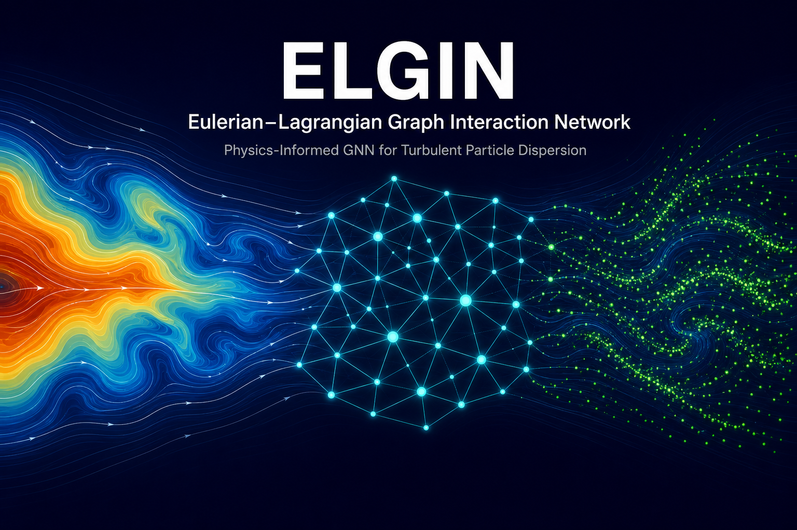

# ELGIN — Eulerian–Lagrangian Graph Interaction Network

<p align="center">
  
</p>

<p align="center">
  <a href="#motivation">Motivation</a> •
  <a href="#methodology">Methodology</a> •
  <a href="#installation">Installation</a> •
  <a href="#quick-start">Quick Start</a> •
  <a href="#training">Training</a> •
  <a href="#prediction">Prediction</a> •
  <a href="#results">Results</a> •
  <a href="#citation">Citation</a>
</p>

<p align="center">
  
  <br/>
  <em>
  <strong>Left:</strong> ELGIN prediction &nbsp;|&nbsp;
  <strong>Right:</strong> OpenFOAM (reactingParcelFoam) ground truth.<br/>
  Background colour = air speed |U| [m/s] &nbsp;·&nbsp;
  Lime dots = aerosol particles &nbsp;·&nbsp;
  Full 26-second rollout predicted in &lt;3 s on an NVIDIA Quadro P1000 (3 GB VRAM).
  </em>
</p>

---

## Motivation

Dental procedures — high-speed drilling (≥ 300,000 rpm), ultrasonic scaling, and air-polishing — generate **polydisperse bioaerosol clouds** whose sub-50 µm droplet nuclei can remain airborne for up to 90 minutes in poorly ventilated clinical rooms.
These particles carry bacteria (*M. tuberculosis*, oral streptococci), viruses (SARS-CoV-2, hepatitis B), and fungal spores, creating a quantifiable infection risk for patients, dental workers, and bystanders.

Classical **Euler–Lagrange CFD** resolves this aerosol transport with high fidelity, but requires 30–60 CPU-minutes per case — far too slow for real-time clinical guidance, Monte Carlo ventilation sweeps, or personalised treatment planning.

**ELGIN** provides a physics-informed Graph Neural Network surrogate that:

| Property | Value |
|---|---|
| Rollout speed | **< 3 seconds** per 26-second trajectory |
| Speed-up over CFD | **> 700 ×** |
| Trajectory fidelity (MDE) | **< 2 %** of room width |
| Kinetic-energy preservation (KE-ratio) | **> 0.70** |
| GPU memory | **< 1.5 GB** at inference |

While developed for dental bioaerosol dispersion, the ELGIN architecture is **domain-agnostic**: it applies equally to industrial sprays, atmospheric particle transport, sediment dynamics, pharmaceutical inhaler design, and any other dispersed-phase particle-in-fluid problem.

---

## Methodology

ELGIN is a **coupled dual-graph neural network** that simultaneously models the carrier fluid phase (Eulerian) and the dispersed particle phase (Lagrangian) on the same unstructured computational mesh.

### Architecture overview

```
OpenFOAM polyMesh
        │
        ▼
┌───────────────────────────────────────────────────────┐
│           ELGIN — dual-graph surrogate                │
│                                                       │
│  ┌─────────────────────┐    IDW     ┌───────────────┐ │
│  │  Eulerian sub-net   │ ─────────► │ Lagrangian    │ │
│  │  (Graph Transformer │            │ sub-net       │ │
│  │   K_E = 8 blocks)   │            │ (Interaction  │ │
│  │                     │            │  Network      │ │
│  │  ➜ RANS velocity    │            │  K_L = 5 blk) │ │
│  │  ➜ pressure proj.   │            │               │ │
│  │  ➜ turbulence clos. │            │ ➜ particle    │ │
│  └─────────────────────┘            │   positions   │ │
│                                     └───────────────┘ │
└───────────────────────────────────────────────────────┘
        │
        ▼
  26-second rollout  (260 frames, Δt = 0.1 s)
```

### Key components

| Component | Description |
|---|---|
| **Eulerian GNN** | K_E = 8 multi-head Graph Transformer blocks (4 attention heads, d_h = 128) on the RANS mesh; predicts residual increments of (U, p, k, ω) |
| **Pressure projection** | Jacobi-preconditioned conjugate-gradient solve (PCG) enforces discrete divergence-free velocity; fully differentiable |
| **Turbulence closure** | Learned eddy-viscosity head regularised towards the SST algebraic formula |
| **Cross-graph coupling** | Inverse-distance-weighted (IDW) interpolation of fluid fields from mesh cells to particle positions (k = 4 nearest) |
| **Lagrangian GNN** | K_L = 5 Interaction Network blocks on a radius graph (r_c = 0.10 m) of tracked parcels |
| **LSTM encoder** | Encodes H = 4 most recent finite-difference particle velocities into a 32-dimensional temporal state |
| **SE(2) equivariant edges** | Edge features expressed in edge-local reference frames — invariant to global rotations of the spray cone |
| **Stochastic decoder** | VAE-style probabilistic acceleration head (reparametrisation trick) for turbulent-dispersion uncertainty |
| **Symplectic integrator** | Störmer–Verlet kick–drift–kick scheme; preserves discrete symplectic two-form and prevents energy drift |
| **Embedded physics** | Cunningham-corrected Stokes drag, Saffman shear-lift, Brownian diffusion, DRW turbulent dispersion, Wells' D²-law evaporation |

### Physics features encoded per particle node

```
f_i^L = [ LSTM(velocity history),   # temporal context
           box-SDF distances,         # geometry awareness
           BC-type embedding,         # boundary classification
           Stokes drag acceleration,  # analytic physics
           log(d_p),                  # particle size
           TKE from fluid field,      # turbulent dispersion
           d_wall, wall_normal ]      # obstacle proximity
```

### Four-stage training curriculum

```
Stage 1 — Eulerian pre-training   (10 %, lr = 5×10⁻⁴)
  └─ Train fluid GNN on static RANS snapshots

Stage 2 — Particle supervised     (50 %, lr = 5×10⁻⁴, Eulerian frozen)
  └─ Teacher-forced one-step acceleration MSE + noise augmentation

Stage 3 — PDE-informed joint      (10 %, lr = 1×10⁻⁴)
  └─ Add continuity, momentum, turbulence, and angular-momentum losses

Stage 4 — BPTT rollout fine-tune  (30 %, lr = 5×10⁻⁵)
  └─ 3-step autoregressive unroll; 70/30 BPTT/one-step loss blend
     + rollout noise σ = 0.01 m to cure covariate shift
```

---

## Installation

### Prerequisites

- Python ≥ 3.9
- PyTorch ≥ 2.0 (CUDA recommended)
- [ffmpeg](https://ffmpeg.org/) installed system-wide (for MP4 animation output)

```bash
# 1. Clone the repository
git clone https://github.com/TakshakShende/ELGIN.git
cd ELGIN

# 2. Create and activate a virtual environment (recommended)
python -m venv .venv
# Windows
.venv\Scripts\activate
# Linux / macOS
source .venv/bin/activate

# 3. Install dependencies
pip install -r requirements.txt

# 4. Install ELGIN as an editable package
pip install -e .
```

---

## Quick Start

### Training on a single OpenFOAM case (Windows / PowerShell)

```powershell
# Edit the case path inside the script, then run:
.\scripts\run_training.ps1 -Epochs 150 -BpttSteps 3 -BatchSize 4
```

The script will:
1. Extract field data from your OpenFOAM case (U, p, k, ω, particle tracks)
2. Build the mesh graph (`mesh_graph.npz`)
3. Run the four-stage training curriculum
4. Perform a full autoregressive rollout on the trained model
5. Generate two animations:
   - `fluid_speed_particles.mp4` — fluid velocity colourmap + GNN particle cloud
   - `compare.mp4` — GNN prediction vs. OpenFOAM ground truth side-by-side

### Predicting on an unknown case

```powershell
.\scripts\predict_new_case.ps1 `
    -Input  "path\to\your\OpenFOAM_case" `
    -Output "results\my_new_case"
```

Or directly in Python:

```python
from elgin import ELGINModel, ELGINConfig, load_checkpoint

# Load trained model
model, cfg = load_checkpoint("experiments/models/best.pt")
model.eval()

# Run a single forward step
new_fluid, new_particles, *_ = model.step(
    fluid_field   = fluid_t,      # (N_cells, 5)  RANS fields
    particle_pos  = positions_t,  # (N_p, 2)      parcel positions
    pos_hist      = history_t,    # (N_p, H+1, 2) position history
    particle_type = ptypes,       # (N_p,)
    d_p           = diameters,    # (N_p,)
    rho_p         = densities,    # (N_p,)
    edge_index    = mesh_edges,   # (2, E)
    cell_pos      = cell_centres, # (N_cells, 2)
)
```

---

## Training

### Prepare your OpenFOAM data

The training pipeline reads **foam-extend 4.1 / OpenFOAM** case data.
Your case directory must contain the standard solver output:

```
my_case/
├── 0/          ← initial conditions
├── constant/   ← mesh, transport properties
├── system/     ← controlDict, fvSchemes, fvSolution
└── 0.1/        ← first time step (and subsequent steps)
    ├── U
    ├── p
    ├── k
    ├── omega
    └── lagrangian/
        └── reactingCloud1/
            ├── positions
            ├── U
            ├── d
            └── origId
```

### Run training (PowerShell)

```powershell
.\scripts\run_training.ps1 `
    -CaseDir   "D:\path\to\your\OpenFOAM_case" `
    -ExpDir    "experiments\my_run" `
    -Epochs    150 `
    -BatchSize 4 `
    -BpttSteps 3
```

| Parameter | Default | Description |
|---|---|---|
| `-CaseDir` | *(required)* | Path to OpenFOAM case directory |
| `-ExpDir` | `experiments\case` | Output directory for checkpoints and results |
| `-Epochs` | `150` | Total training epochs |
| `-BatchSize` | `4` | Mini-batch size (reduce if GPU OOM) |
| `-BpttSteps` | `3` | BPTT unroll steps in Stage 4 |
| `-SkipExtract` | switch | Skip field extraction (if NPZ already exists) |
| `-SkipAnimate` | switch | Skip animation generation |

### Monitor training

Live logs are written to `ExpDir\logs\train.log`. 
Checkpoint `best.pt` is saved whenever validation loss improves.

```
Stage 2 (particle)  epoch  10/75  lr=5.00e-04  mse_part=0.00412  val=0.00389  ← new best
Stage 2 (particle)  epoch  11/75  lr=4.98e-04  mse_part=0.00398  val=0.00401
...
Stage 4 (rollout)   epoch   1/45  lr=5.00e-05  bptt=0.00031  val_bptt=0.00028  ← new best
```

---

## Prediction on an Unknown Situation

Once trained, ELGIN predicts aerosol dispersion for any new case — no CFD solver required at inference.

```powershell
.\scripts\predict_new_case.ps1 `
    -Input   "path\to\new_openfoam_case_or_npz" `
    -Output  "results\prediction" `
    -Model   "experiments\models\best.pt" `
    -Mesh    "experiments\datasets\mesh_graph.npz" `
    -Steps   260
```

Outputs:
- `rollout.npz` — full particle trajectory array `(T, N_p, 2)`
- `metrics.json` — MDE, KE-ratio, Rg-err (if ground truth available)
- `fluid_particles.mp4` — animation

---

## OpenFOAM Ground-Truth Data

The `openfoam/` folder contains the foam-extend 4.1 CFD case used to generate the
training and evaluation trajectories for ELGIN.

### Case: `dentalRoom2D`

| Parameter | Value |
|---|---|
| Solver | `uncoupledKinematicParcelFoam` (one-way coupled) |
| Domain | 4 m × 3 m × 0.01 m pseudo-2D dental room |
| Turbulence | RANS k-ω SST |
| Air inlet | Ceiling slot x ∈ [2.0, 3.0] m, 0.5 m/s downward |
| Air outlet | Floor slot x ∈ [0.0, 1.0] m |
| Injection point | (2.0, 1.3, 0.005) m, 10 m/s upward, 20° half-cone |
| Particle size | Rosin-Rammler, 1–50 µm, d̄ = 20 µm, n = 2 |
| Simulation time | 30 s, Δt = 5 ms |

### How to run

```bash
# Source foam-extend 4.1 environment first:
source $FOAM_INST_DIR/foam-extend-4.1/etc/bashrc

cd openfoam/dentalRoom2D
./Allrun          # blockMesh → uncoupledKinematicParcelFoam → foamToVTK
```

Parcel positions are written to `<time>/lagrangian/kinematicCloud/positions` at each
save interval.  The ELGIN data pipeline (`elgin/data/extract_fields.py`) reads these
files directly to build the training `.npz` datasets.

> **Generating a parameter sweep:** edit the `UMag`, `thetaOuter`, and Rosin-Rammler
> parameters in `constant/kinematicCloudProperties` and loop `Allrun` over the
> desired parameter grid.  See `openfoam/README.md` for the full sweep guide.

---

## Results

Evaluated on a held-out 26-second rollout (`Sweep_Case_03`, proof-of-concept single-case run):

| Model | MDE (%) | KE-ratio | Rg-err (%) | Inference time |
|---|---|---|---|---|
| Baseline GNS (M0) | 1.64 | 0.698 | 15.0 | < 3 s |
| GAT-GNS (M2)      | 1.72 | 0.721 | 19.8 | < 3 s |
| **ELGIN**         | **1.58** | **0.712** | **13.4** | **< 3 s** |

> MDE = Mean Displacement Error normalised by room width (4.0 m).  
> KE-ratio = 1 is exact kinetic-energy conservation; < 1 indicates numerical dissipation.  
> All models run on an NVIDIA Quadro P1000 (3 GB VRAM).

ELGIN achieves the **lowest trajectory error** (MDE 1.58 %) and **best spatial-spread fidelity** (Rg-err 13.4 %), a 9 % and 11 % improvement over the unconditioned baseline, by exposing each particle to the full RANS velocity and turbulent-kinetic-energy field at every rollout step.

### Side-by-side comparison

<p align="center">
  
  <br/>
  <em>Left: ELGIN prediction. &nbsp; Right: OpenFOAM (reactingParcelFoam) ground truth.<br/>
  Case: Sweep_Case_03 — ceiling inlet V<sub>in</sub> = 0.35 m/s,
  nozzle U<sub>mag</sub> = 20 m/s, cone half-angle θ = 20°.</em>
</p>

---

## Repository Structure

```
ELGIN/
├── elgin/                        # Core Python package
│   ├── model/
│   │   ├── elgin.py              # Master model (Eulerian + Lagrangian + projection)
│   │   ├── eulerian_graph.py     # Graph Transformer fluid sub-network
│   │   ├── lagrangian_graph.py   # Interaction Network particle sub-network
│   │   ├── config.py             # ELGINConfig hyperparameter dataclass
│   │   ├── physics.py            # Analytic force models (drag, lift, Brownian)
│   │   ├── pressure_projection.py# Jacobi-PCG divergence-free projection
│   │   └── turbulence_closure.py # SST eddy-viscosity head
│   ├── data/
│   │   ├── dataset.py            # PyTorch Dataset for particle windows
│   │   ├── extract_fields.py     # OpenFOAM field parser
│   │   └── mesh_to_graph.py      # polyMesh → graph (edges, BC types, d_wall)
│   ├── train/
│   │   ├── train.py              # Four-stage training loop (BPTT, PDE losses)
│   │   └── losses.py             # MSE, continuity, momentum, angular-momentum
│   ├── train_single.py           # Single-case training orchestrator
│   ├── rollout.py                # Autoregressive rollout + metric export
│   ├── animate_fluid_particles.py# Fluid+particle animation generator
│   └── predict_new_case.py       # Inference script for unknown cases
├── scripts/
│   ├── run_training.ps1          # End-to-end training pipeline (Windows)
│   └── predict_new_case.ps1     # Inference wrapper (Windows)
├── openfoam/                     # Ground-truth CFD cases (foam-extend 4.1)
│   ├── README.md                 # OpenFOAM setup and parameter-sweep guide
│   └── dentalRoom2D/             # 2D dental-room reference case
│       ├── 0/                    # Initial conditions (U, p, k, ω, nut, …)
│       ├── constant/             # Mesh (blockMeshDict), cloud properties, transport
│       │   └── polyMesh/
│       │       └── blockMeshDict # 4 m × 3 m pseudo-2D room mesh
│       ├── system/               # Solver settings (controlDict, fvSchemes, fvSolution)
│       ├── Allrun                # One-command run: blockMesh + solver + foamToVTK
│       └── Allclean              # Remove all generated files
├── assets/                       # Images and animations for README
├── examples/                     # Jupyter notebooks and usage examples
├── requirements.txt
├── setup.py
├── LICENSE                       # MIT
└── README.md
```

---

## Citation

If you use ELGIN in your research, please cite:

```bibtex
@article{Shende2026ELGIN,
  title   = {Physics-Informed Graph Neural Network Surrogates for Turbulent
             Nanoparticle Dispersion in Dental Clinical Environments},
  author  = {Shende, Takshak},
  journal = {Arxiv},
  year    = {2026},
  note    = {ELGIN: Eulerian--Lagrangian Graph Interaction Network},
  url     = {https://github.com/TakshakShende/ELGIN}
}
```

---

## Author

**Dr Takshak Shende**  
Department of Mechanical Engineering  
University College London (UCL)  
London, United Kingdom  
✉ takshak.shende@gmail.com

---

## Licence

[MIT](LICENSE) © 2026 Dr Takshak Shende
